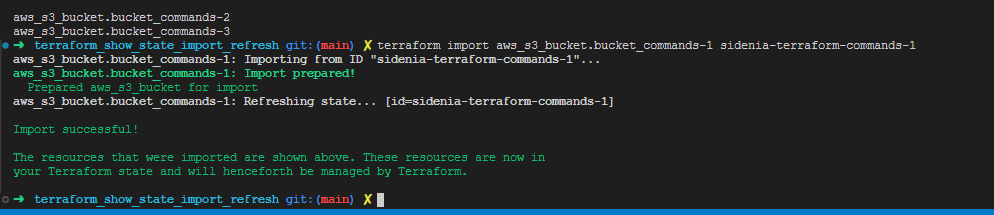

# TERRAFORM SHOW
===============

## terraform show plan.out 
mostra o plano de execução

## terraform show
formato facil para leitura humana do conteúdo do state.

# TERRAFORM STATE
===============
## terraform state list
lista os recursos contidos no state

## terraform state rm aws_s3_bucket.bucket_commands-1 aws_s3_bucket.bucket_commands-um
renomear o nome de um recurso

## terraform state pull
pega o state remoto atual e mostra no terminal

## terraform state pull > state.tfstate 
pega o state remoto atual e exporta pra um arquivo

## terraform state push nomedoarquivo.tfstate
subir um state local para o remoto
ex> terraform state push state.tfstate

se der um erro dizendo que o serial do remoto ta maior, mas voce precisa mandar um serial para voltar uma versao do state, pode forçar o pull com:
    - terraform state push -force state.tfstate

## terraform state replace-provider 
trocar o provider no state (após supondo que alterou na configuração do codigo)
ex: terraform state replace-provider registry.terraform.io/hashcorp/aws registry.terraform.io/hashcorp/aws-v2

## terraform rm
remove instancias do state

## terraform state show nomdorecurso
Mostra os recursos no state
ex> terraform state show aws_s3_bucket.bucket_commands-1

## terraform state rm
Se não quer que o terraform gerencie mais determinado recurso, pode remove-lo do state
ex> terraform state rm aws_s3_bucket.bucket_commands-1

## terraform providers 
mostra os providers e versoes que estao usados no codigo

# TERRAFORM IMPORT
==========================
- cada provider tem uma forma de importar recursos
AWS: terraform import aws_s3_bucket.bucket bucket-name
ex> terraform import aws_s3_bucket.bucket_commands-1 sidenia-terraform-commands-1

# TERRAFORM REFRESH
==========================
Se voce vai no managment console da aws e altera algum recurso por lá, voce pode atualizar seu state com essa alteração. 

terraform refresh

todavia esse comando só atualiza o state, mas nao adiciona as alteracoes no código.. então a utilidade dela é baixa.

# TERRAFORM INIT
==========================
## terraform init -reconfigure
    Reconfigura o backend, ignorando qualquer config salva. Inicializar um backend zerado.
    Ele começa com um state novo do zero, em um diretorio novo. Apos isso, se voce realiza o plan, ele vai querer criar todos os recursos novamente do zero, visto que limpou toda a state anterior.

## terraform init -migrate-state
    Reconfigura o backend em um novo local (com um nome novo) e levando o state existente
    Submete para migrar qualquer estado existente. Pergunta se deseja migrar.

## terraform init -force-copy
    migra o state para um novo lugar (novo diretorio que vc possa ter setado no backend) e nao vai questionar.

## terraform init -backend-config
    Passar um backend dinamico, em dev salvar num local, hom em outro, prod em outro... 
    como fazer?

    - no bloco do terraform, passa o backend como bloco vazio: 
        backend {}
    - cria um arquivo para cada um dos diretorios de ambiente (DEV/HOM/PROD) 
    - No terminal executa> 
        terraform init -backend-config=backend-dev.hcl

# ATENÇÃO > o terraform nao aceita variáveis dentro do bloco do terraform. 